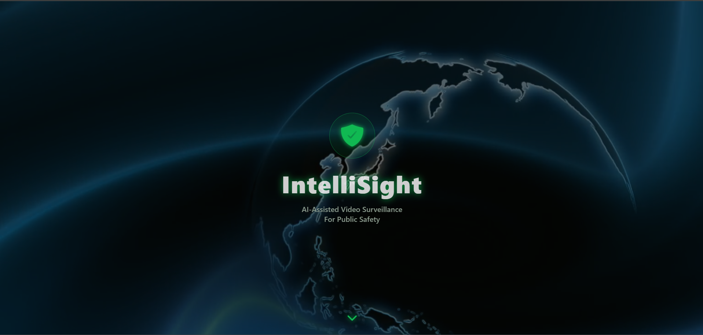
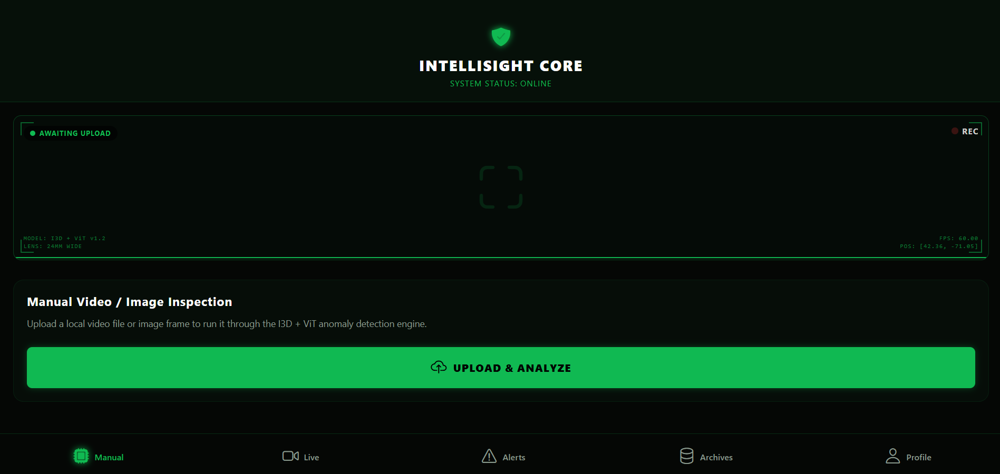
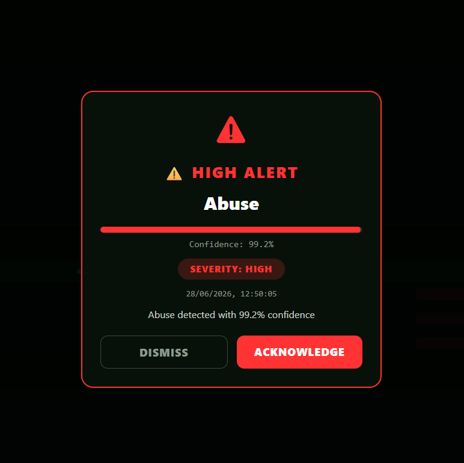

<div align="center">

# 🚀 IntelliSight

### AI-Assisted Video Surveillance System for Public Safety

An AI-powered intelligent surveillance platform capable of detecting abnormal events from uploaded videos and live surveillance streams using Deep Learning and Computer Vision.

<p>


</p>

</div>

---

# 📖 Overview

**IntelliSight** is an AI-powered intelligent surveillance platform developed as a **Bachelor of Computer Science Final Year Project** to improve public safety through automated anomaly detection.

Traditional CCTV surveillance requires continuous human monitoring, making it difficult for operators to detect suspicious events in real time. Human fatigue, distraction, and the increasing number of surveillance cameras significantly reduce monitoring efficiency.

IntelliSight solves this problem by combining **Artificial Intelligence**, **Computer Vision**, **Deep Learning**, and **Cloud Computing** to automatically analyze surveillance footage and generate instant alerts whenever suspicious activities are detected.

The platform supports both uploaded surveillance videos and live camera streams, enabling security personnel to monitor public spaces more effectively while reducing manual effort.

---

# 🎯 Objectives

The primary objectives of IntelliSight are:

- Detect abnormal activities from surveillance footage using AI.
- Reduce dependency on continuous manual CCTV monitoring.
- Generate real-time alerts for suspicious activities.
- Support uploaded videos as well as live surveillance streams.
- Store detection history and alert logs.
- Provide an intuitive dashboard for security personnel.
- Generate downloadable reports for future investigation.
- Demonstrate a scalable cloud-based surveillance architecture.

---

# ❗ Problem Statement

Monitoring hundreds of CCTV cameras simultaneously is a challenging task for security operators.

Some common challenges include:

- Human fatigue during prolonged monitoring.
- Missed suspicious events.
- Delayed emergency response.
- Increasing number of surveillance cameras.
- Difficulty in reviewing long surveillance recordings.

These challenges often lead to delayed identification of critical incidents such as violence, burglary, road accidents, and other public safety threats.

---

# 💡 Proposed Solution

IntelliSight provides an AI-assisted surveillance solution capable of automatically analyzing surveillance footage and identifying suspicious activities.

The system:

- Receives surveillance footage.
- Extracts representative video frames.
- Processes the frames using Deep Learning models.
- Predicts whether the activity is normal or abnormal.
- Calculates confidence scores.
- Generates alerts whenever abnormal behavior is detected.
- Stores results in a PostgreSQL database.
- Displays detections and reports on a modern dashboard.

---

# ✨ Key Features

## 🔐 Authentication

- User Registration
- Secure Login
- JWT Authentication
- Protected API Endpoints

---

## 🎥 Video Analysis

- Upload surveillance videos
- AI-based anomaly detection
- Confidence score prediction
- Severity estimation
- Timeline generation

---

## 📡 Live Surveillance

Supports multiple live surveillance modes:

- Demo Video Stream
- Mobile IP Camera
- RTSP Camera
- CCTV/IP Camera Integration

---

## 🤖 AI Detection

Current AI pipeline detects:

- Normal Activities
- Fighting
- Shooting
- Road Accidents
- Burglary

---

## 🚨 Alert System

Automatic alert generation with:

- Alert Popup
- Confidence Score
- Severity Level
- Detection Timestamp
- Alert Acknowledgement
- Alert Dismissal

---

## 📚 Detection History

Stores:

- Detection Label
- Confidence
- Severity
- Detection Time
- Camera Source

---

## 🗂 Alert Archive

Allows administrators to:

- Archive alerts
- Review archived alerts
- Maintain investigation history

---

## 📄 Reports

Generate reports including:

- Detection history
- Alert logs
- Confidence scores
- Severity levels
- Detection timestamps

---

# 📸 Project Screenshots

## 🚀 Splash Screen

<p align="center">

</p>

The splash screen welcomes users to IntelliSight before navigating to the authentication system.

---

## 📊 Dashboard

<p align="center">

</p>

The dashboard serves as the central hub of the application where users can upload videos, access live surveillance, review alerts, generate reports, and monitor overall system activity.

---

## 🎥 Live Surveillance

<p align="center">

</p>

The Live Surveillance screen displays:

- Connected Camera Information
- Live Stream Status
- Detection History
- AI Prediction
- Confidence Score
- Severity Level
- Stream Controls

> **Recommendation:** Rename `anomaly detect.png` to `anomaly-detect.png` for cleaner GitHub image paths.

---

## 🚨 Real-Time Alert Notification

<p align="center">

</p>

Whenever IntelliSight detects suspicious activity, an alert popup is generated automatically displaying:

- Detected anomaly
- Confidence percentage
- Severity level
- Detection timestamp
- Acknowledge button
- Dismiss button

---

# ⚙️ Technology Stack

| Category | Technologies |
|----------|--------------|
| Frontend | React Native, Expo, TypeScript, React Navigation, Axios, HLS.js |
| Backend | Python, Flask, Flask-JWT-Extended, SQLAlchemy, Gunicorn |
| AI | PyTorch, TorchVision, timm, OpenCV |
| Database | PostgreSQL |
| Live Streaming | Node.js, Express.js, FFmpeg, HLS |
| Deployment | Docker, Docker Compose, AWS EC2, Nginx |

---

# 🤖 AI Models

IntelliSight combines multiple AI models to improve anomaly detection performance.

### Vision Transformer (ViT)

The Vision Transformer performs spatial feature extraction from sampled video frames and predicts scene-level anomalies.

### Inflated 3D Network (I3D)

The I3D model captures temporal information across consecutive frames, enabling the detection of motion-based anomalies.

### Fusion Strategy

Predictions from ViT and I3D are fused to produce the final prediction, confidence score, and severity level.

Current supported classes include:

- Normal Videos
- Fighting
- Shooting
- Road Accidents
- Burglary

---

# 🏗 System Architecture

```text
                    IntelliSight Architecture

             Camera / Uploaded Video
                       │
                       ▼
              Video Preprocessing
                       │
      ┌────────────────┴────────────────┐
      ▼                                 ▼
Vision Transformer (ViT)          I3D Network
      │                                 │
      └──────────────┬──────────────────┘
                     ▼
               Fusion Service
                     ▼
          Final AI Prediction
                     ▼
             Alert Generation
                     ▼
            PostgreSQL Database
                     ▼
 Dashboard • Alerts • Reports • Archives
```

---

# 📂 Project Structure

```text
IntelliSight/
│
├── final_build/
│   ├── backend/
│   ├── frontend/
│   ├── live-server/
│   ├── docs/
│   │   └── images/
│   └── docker-compose.yml
│
├── README.md
└── LICENSE
```

---

# 🚀 Running IntelliSight Locally

IntelliSight can be executed on any Windows, Linux, or macOS machine with the required dependencies installed.

## 📋 Prerequisites

Before running the project, ensure the following software is installed:

| Software | Version |
|----------|----------|
| Python | 3.10 or above |
| Node.js | 18+ |
| PostgreSQL | Latest |
| FFmpeg | Latest |
| Git | Latest |

---

# 📥 Clone the Repository

Clone the project from GitHub.

```bash
git clone https://github.com/muhmubeen1/IntelliSight.git
cd IntelliSight
```

---

# ⚙️ Backend Setup

Navigate to the backend directory.

```bash
cd final_build/backend
```

Install all required Python packages.

```bash
pip install -r requirements.txt
```

Start the Flask backend.

```bash
python app.py
```

The backend server will start on:

```
http://localhost:5000
```

Verify the backend is running by opening:

```
http://localhost:5000/health
```

---

# 💻 Frontend Setup

Open a new terminal.

Navigate to the frontend.

```bash
cd final_build/frontend
```

Install all required packages.

```bash
npm install
```

Run the frontend.

```bash
npm start
```

or

```bash
npm run web
```

The frontend will run on:

```
http://localhost:3000
```

---

# 📡 Live Streaming Server

Open another terminal.

Navigate to the live-server.

```bash
cd final_build/live-server
```

Install dependencies.

```bash
npm install
```

Start the streaming server.

```bash
node server.js
```

The streaming server runs on:

```
http://localhost:4000
```

---

# 🗄 PostgreSQL

Ensure PostgreSQL is running.

Create a database named:

```
intellisight
```

After starting PostgreSQL, the backend will connect automatically using the configured database settings.

---

# ▶️ Running the Complete Application

After all services are running:

| Service | URL |
|----------|-----|
| Frontend | http://localhost:3000 |
| Backend API | http://localhost:5000 |
| Live Streaming Server | http://localhost:4000 |

You can now:

- Register a new user
- Login securely
- Upload surveillance videos
- Analyze videos using AI
- Connect RTSP/IP cameras
- Start live surveillance
- Receive AI-generated alerts
- Archive alerts
- View detection history
- Generate PDF reports

---

# 🌐 Cloud Deployment

IntelliSight is not limited to local execution.

The complete application has also been successfully deployed on the cloud using a fully containerized architecture.

### Deployment Stack

- AWS EC2
- Docker
- Docker Compose
- Flask Backend API
- React Native (Expo Web)
- PostgreSQL Database
- Node.js Live Streaming Server
- Gunicorn WSGI Server
- Nginx Reverse Proxy
- HTTPS Secure Domain

The deployed architecture enables users to securely access IntelliSight remotely while supporting real-time surveillance, AI inference, alert generation, and report management.

---

# 🔄 Application Workflow

```text
                  User Uploads Video
                           │
                           ▼
                 Video Preprocessing
                           │
                           ▼
               Frame Extraction
                           │
        ┌──────────────────┴──────────────────┐
        ▼                                     ▼
 Vision Transformer (ViT)             I3D / R3D Model
        │                                     │
        └──────────────────┬──────────────────┘
                           ▼
                     Fusion Service
                           ▼
                  Final Prediction
                           ▼
             Confidence & Severity
                           ▼
                 Alert Generation
                           ▼
                Store in PostgreSQL
                           ▼
             Dashboard & Detection Logs
```

---

# 📹 Live Streaming Workflow

```text
      Demo Video
           │
           │
      Mobile Camera
           │
           │
      RTSP Camera
           │
           ▼
    Node.js Live Server
           │
           ▼
         FFmpeg
           │
           ▼
    HLS (.m3u8 + .ts)
           │
           ▼
 React Frontend Player
           │
           ▼
 Flask AI Backend
           │
           ▼
      AI Detection
           │
           ▼
    Alert Notification
           │
           ▼
 PostgreSQL Database
```

---

# 🔌 REST API Overview

## Authentication

| Method | Endpoint | Description |
|----------|----------|-------------|
| POST | `/api/auth/register` | Register a new user |
| POST | `/api/auth/login` | Authenticate user |

---

## Video Analysis

| Method | Endpoint | Description |
|----------|----------|-------------|
| POST | `/api/classify` | Upload and analyze a video |
| GET | `/api/detections` | Retrieve detection history |

---

## Alerts

| Method | Endpoint | Description |
|----------|----------|-------------|
| GET | `/api/alerts` | Retrieve all alerts |
| POST | `/api/alerts/{id}/review` | Archive an alert |

---

## Reports

| Method | Endpoint | Description |
|----------|----------|-------------|
| GET | `/api/reports/detections` | Detection report |
| GET | `/api/reports/detections/pdf` | Export PDF report |

---

## Health

| Method | Endpoint | Description |
|----------|----------|-------------|
| GET | `/health` | Backend health check |

---

# 🗃 Database Overview

IntelliSight uses PostgreSQL as its primary database.

### Users

Stores registered user information.

- User ID
- Name
- Email
- Password

---

### Videos

Stores uploaded surveillance videos.

- Video ID
- Filename
- Upload Time
- Processing Status

---

### Detection Events

Stores AI predictions.

- Detection ID
- Detected Activity
- Confidence Score
- Timestamp
- Video ID

---

### Alerts

Stores generated alerts.

- Alert ID
- Severity
- Message
- Status
- Created Time

---

# 🔒 Security Features

IntelliSight incorporates multiple security mechanisms:

- JWT Authentication
- Protected REST APIs
- Secure Database Storage
- HTTPS Support (Cloud Deployment)
- Input Validation
- Secure Session Management

---

# 📈 Performance Highlights

- Real-time video analysis
- Low-latency HLS streaming
- Efficient frame sampling
- Deep Learning inference using PyTorch
- Optimized Docker deployment
- Cloud-hosted architecture
- Modular backend services

---

# 🚀 Future Enhancements

Although IntelliSight provides a complete AI-assisted surveillance solution, several enhancements can further improve its capabilities and scalability.

### Artificial Intelligence
- Improve Vision Transformer (ViT) classification accuracy using larger and more diverse datasets.
- Train advanced temporal models such as Video Swin Transformer or SlowFast Networks.
- Support multiple anomaly classes from the complete UCF-Crime dataset.
- Integrate object detection (YOLOv11/YOLOv12) with anomaly detection for more detailed event analysis.
- Introduce real-time object tracking to follow suspicious individuals or vehicles.
- Add face recognition for authorized personnel identification.

### Live Surveillance
- Multi-camera monitoring dashboard.
- Simultaneous analysis of multiple RTSP/IP camera feeds.
- Automatic camera discovery on the local network.
- Camera health monitoring.
- Camera grouping and management.

### Notifications
- Email notifications.
- SMS alerts.
- Push notifications for mobile devices.
- Telegram or WhatsApp alert integration.
- Emergency escalation for high-severity events.

### Dashboard & Analytics
- Interactive analytics dashboard.
- Monthly and yearly detection statistics.
- Heatmaps showing anomaly hotspots.
- Camera performance metrics.
- Detection accuracy reports.

### Cloud Features
- Cloud storage for uploaded videos.
- Automatic database backup.
- Horizontal scaling using Kubernetes.
- CI/CD pipeline for automated deployment.
- Monitoring using Prometheus and Grafana.

---

# ⚠ Challenges Faced During Development

Developing IntelliSight involved several technical challenges that required careful planning and iterative improvements.

### AI Model Training
- Limited computational resources for training deep learning models.
- Class imbalance in anomaly datasets.
- Achieving acceptable accuracy while maintaining real-time performance.
- Optimizing inference time for live surveillance.

### Live Streaming
- Converting RTSP and IP camera feeds into HLS format.
- Reducing streaming latency.
- Maintaining stable connections across different camera types.
- Synchronizing live video analysis with frontend updates.

### Backend Development
- Efficient management of uploaded video files.
- Secure authentication and authorization.
- Handling concurrent AI inference requests.
- Reliable storage of detections and alerts.

### Cloud Deployment
- Containerizing multiple services.
- Configuring reverse proxy.
- Managing secure HTTPS communication.
- Deploying interconnected services on AWS EC2.

---

# 📚 Lessons Learned

Developing IntelliSight provided valuable experience in:

- Full-stack web development
- Deep learning model integration
- Computer vision
- Cloud deployment
- Docker containerization
- REST API development
- Database design
- Real-time streaming technologies
- Team collaboration
- Software project management

---

# 🎓 Academic Contribution

IntelliSight demonstrates the practical application of Artificial Intelligence in surveillance systems by integrating:

- Computer Vision
- Deep Learning
- Web Technologies
- Cloud Computing
- Real-Time Streaming
- Database Systems

The project serves as an educational example of how multiple modern technologies can be combined to solve real-world public safety challenges.

---

# 📈 Project Highlights

✔ AI-powered anomaly detection

✔ Real-time surveillance

✔ Live streaming support

✔ Secure authentication

✔ Dockerized architecture

✔ PostgreSQL integration

✔ Cloud deployment

✔ Report generation

✔ Alert management

✔ Modern responsive user interface

✔ Modular backend architecture

✔ Scalable system design

---

# 👨‍💻 Contributors

## Muhammad Mubeen

**Responsibilities**

- Backend Development
- Artificial Intelligence Integration
- Database Design
- REST API Development
- Cloud Deployment
- Docker Configuration
- AI Model Training
- System Integration

---

## Rohaan Jaffar

**Responsibilities**

- Frontend Development
- User Interface Design
- Application Testing
- Documentation
- User Experience Improvements

---


---

# 📌 Conclusion

IntelliSight is a comprehensive AI-assisted surveillance system that demonstrates the integration of Artificial Intelligence, Computer Vision, Cloud Computing, and Modern Web Technologies into a unified platform for intelligent public safety monitoring.

By combining Vision Transformer (ViT), temporal video analysis, real-time streaming, secure backend services, and an intuitive dashboard, IntelliSight automates the process of identifying suspicious activities, generating alerts, and maintaining detailed detection records.

The modular architecture, cloud deployment, and scalable design make IntelliSight suitable not only as an academic Final Year Project but also as a strong foundation for future research and real-world intelligent surveillance applications.

---

<div align="center">

## ⭐ If you like IntelliSight, don't forget to Star the Repository!

**Made with ❤️ using Python, Flask, React Native, PyTorch, PostgreSQL, Docker, and AWS.**

</div>
